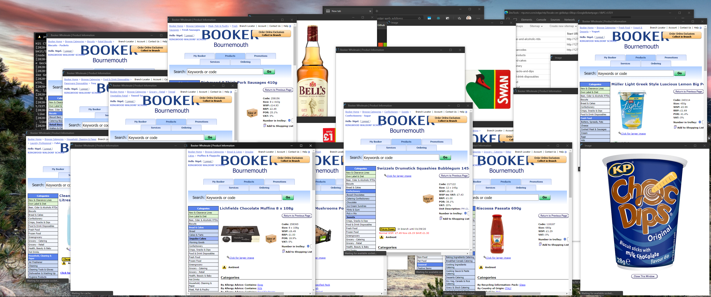

# Booker Web Scrapper



- Scrap all sub categories of categories of products on booker website
- scarp each indivual product page and get detailed information
- Store scraped data in database - Excel not cutting it
- Make Node or Python API to backwards engineer Booker scanner.

## Selenium webdriver IO

Huge browser automation suite in different languages used by companies to to integrations testing.  
Has to render everything like a real user which takes time/power.

### Javascript

Status: **Doesn't work**

Javascript is javascript so it knows javascript objects and javascript object notation!  
Syntax of async await and try catch for everything becomes a little boring for some reason python does not need this as far as have seen.  
Can't get to work for even login has timeout issue and cannot access content.

### Python

Status: **Working perfectly**

Both working:

- product-list-scraper.py
- product-page-scraper.py

Python does not natively have a clue what Javascript objects are (no surprise) so trying to construct and output json is very ugly as have to use dictionaries all the time.  
Much easier to construct flat row and write to CSV file --- and then convert CSV to JSON file.
As using simple flat data structure might look at making CSV data go into MariaDb / MySQL instead.

### Todo

- script crashes when accessing index of un found element on page.
- use .env for credentials
- use common login module
- maybe merge scripts maybe not
- nutrition information bit complicated in a table maybe stringify html?
- remove rubbish from data if any more
- remove wholesale qty from product name (regex) might be finished
- !!!!! Product list does not support pagination

how to set up .env

BOOKER_EMAIL  
BOOKER_PASSWORD

pip install python-dotenv

```py
import os
from dotenv import load_dotenv
project_folder = os.path.expanduser('~/my-project-dir') # adjust as appropriate
load_dotenv(os.path.join(project_folder, '.env'))

import os
SECRET_KEY = os.getenv("SECRET_KEY")
```

## Scrappy / BeautifulSoup

Status: **Tried very hard can't get past first step**

Scrappy is proper job built it with all the tools.  
Very fast does not need to interact with javascript etc if not needed.  
Has established framework with structure and functions for collecting, cleaning and outputting data with pipelines etc.  
Default Scrappy project structure is too boilerplate but can use single file which is nice and concise.  
All the tools for the Job seems like a great choice.

### Problems

ASP.NET MVC SiteCore uses ViewState generator mechanism which makes proper scrapping code unpredictable and flaky.  
Scrappy is lower lover than a browser automation tool and need more understanding of how website actually works.  
Can not work out how to get Scrappy to change page source and scrap product pages after logging in!  
Can view some hidden directories but unable to access content to scrap.

### Tradeoff - Scrappy VS Selenium

Selenium bit slower and heavy process to run but guaranteed to be able to simulate anything a user would without any technical challenges.

## Booker Scanner

Booker not using phone sales so customer have to buy expensive scanner that uses IE11 and upload file of barcode list to booker website to add items to shopping list.
Can scrap Product barcode from website and store in product object.
Can backwards engineer file outputted by scanner and create it using custom API which is given list of products by Id/Sku and quantity.
